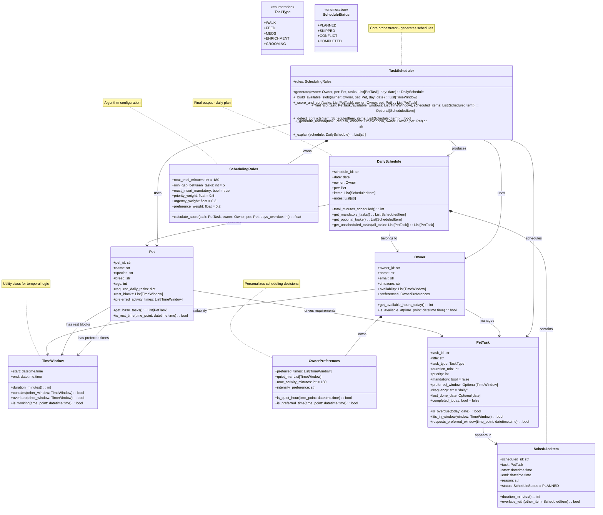

# PawPal+ UML Design

```mermaid
classDiagram
    %% PawPal+ UML Design - Mermaid Format
    %% Generated from XML UML specification

    %% Enums
    class TaskType {
        <<enumeration>>
        +WALK
        +FEED
        +MEDS
        +ENRICHMENT
        +GROOMING
    }

    class ScheduleStatus {
        <<enumeration>>
        +PLANNED
        +SKIPPED
        +CONFLICT
        +COMPLETED
    }

    %% Core Classes
    class TimeWindow {
        +start: datetime.time
        +end: datetime.time
        +duration_minutes(): int
        +contains(other_window: TimeWindow): bool
        +overlaps(other_window: TimeWindow): bool
        +is_working(time_point: datetime.time): bool
    }

    class OwnerPreferences {
        +preferred_times: List[TimeWindow]
        +quiet_hrs: List[TimeWindow]
        +max_activity_minutes: int = 180
        +intensity_preference: str
        +is_quiet_hour(time_point: datetime.time): bool
        +is_preferred_time(time_point: datetime.time): bool
    }

    class Owner {
        +owner_id: str
        +name: str
        +email: str
        +timezone: str
        +availability: List[TimeWindow]
        +preferences: OwnerPreferences
        +get_available_hours_today(): int
        +is_available_at(time_point: datetime.time): bool
    }

    class Pet {
        +pet_id: str
        +name: str
        +species: str
        +breed: str
        +age: int
        +required_daily_tasks: dict
        +rest_blocks: List[TimeWindow]
        +preferred_activity_times: List[TimeWindow]
        +get_base_tasks(): List[PetTask]
        +is_rest_time(time_point: datetime.time): bool
    }

    class PetTask {
        +task_id: str
        +title: str
        +task_type: TaskType
        +duration_min: int
        +priority: int
        +mandatory: bool = false
        +preferred_window: Optional[TimeWindow]
        +frequency: str = "daily"
        +last_done_date: Optional[date]
        +completed_today: bool = false
        +is_overdue(today: date): bool
        +fits_in_window(window: TimeWindow): bool
        +respects_preferred_window(time_point: datetime.time): bool
    }

    class ScheduledItem {
        +scheduled_id: str
        +task: PetTask
        +start: datetime.time
        +end: datetime.time
        +reason: str
        +status: ScheduleStatus = PLANNED
        +duration_minutes(): int
        +overlaps_with(other_item: ScheduledItem): bool
    }

    class DailySchedule {
        +schedule_id: str
        +date: date
        +owner: Owner
        +pet: Pet
        +items: List[ScheduledItem]
        +notes: List[str]
        +total_minutes_scheduled(): int
        +get_mandatory_tasks(): List[ScheduledItem]
        +get_optional_tasks(): List[ScheduledItem]
        +get_unscheduled_tasks(all_tasks: List[PetTask]): List[PetTask]
    }

    class SchedulingRules {
        +max_total_minutes: int = 180
        +min_gap_between_tasks: int = 5
        +must_insert_mandatory: bool = true
        +priority_weight: float = 0.5
        +urgency_weight: float = 0.3
        +preference_weight: float = 0.2
        +calculate_score(task: PetTask, owner: Owner, pet: Pet, days_overdue: int): float
    }

    class TaskScheduler {
        +rules: SchedulingRules
        +generate(owner: Owner, pet: Pet, tasks: List[PetTask], day: date): DailySchedule
        +_build_available_slots(owner: Owner, pet: Pet, day: date): List[TimeWindow]
        +_score_and_sort(tasks: List[PetTask], owner: Owner, pet: Pet): List[PetTask]
        +_find_slot(task: PetTask, available_windows: List[TimeWindow], scheduled_items: List[ScheduledItem]): Optional[ScheduledItem]
        +_detect_conflicts(item: ScheduledItem, items: List[ScheduledItem]): bool
        +_generate_reason(task: PetTask, window: TimeWindow, owner: Owner, pet: Pet): str
        +_explain(schedule: DailySchedule): List[str]
    }

    %% Relationships
    Owner *-- OwnerPreferences : owns
    Owner --> TimeWindow : has availability
    Pet --> TimeWindow : has rest blocks
    Pet --> TimeWindow : has preferred times
    Pet --> PetTask : drives requirements
    Owner --> PetTask : manages
    PetTask --> ScheduledItem : appears in
    DailySchedule *-- ScheduledItem : contains
    DailySchedule --> Owner : belongs to
    DailySchedule --> Pet : concerns
    TaskScheduler *-- SchedulingRules : owns
    TaskScheduler --> Owner : uses
    TaskScheduler --> Pet : uses
    TaskScheduler --> PetTask : schedules
    TaskScheduler --> DailySchedule : produces

    %% Notes
    note for TimeWindow "Utility class for temporal logic"
    note for OwnerPreferences "Personalizes scheduling decisions"
    note for TaskScheduler "Core orchestrator - generates schedules"
    note for DailySchedule "Final output - daily plan"
    note for SchedulingRules "Algorithm configuration"
```